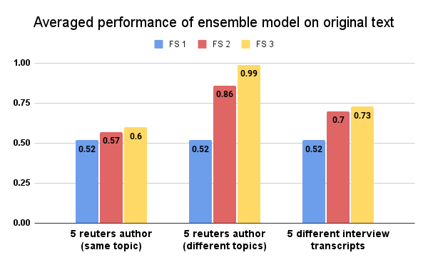
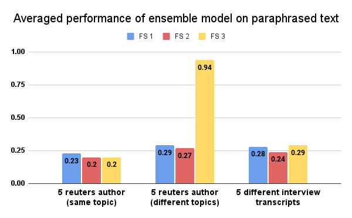
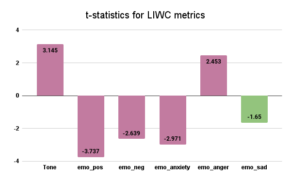
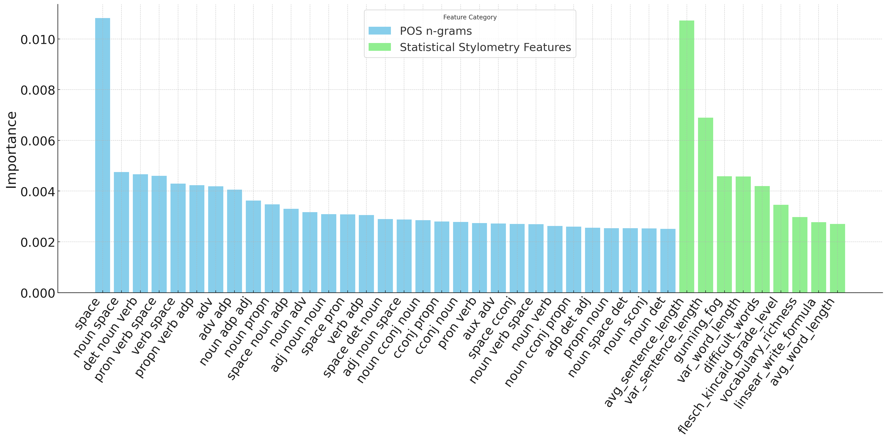
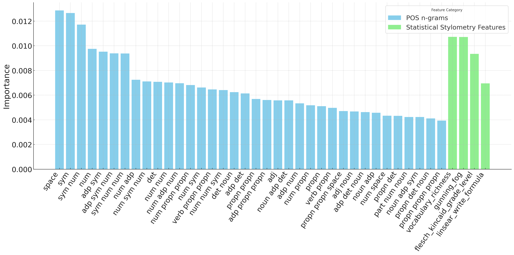
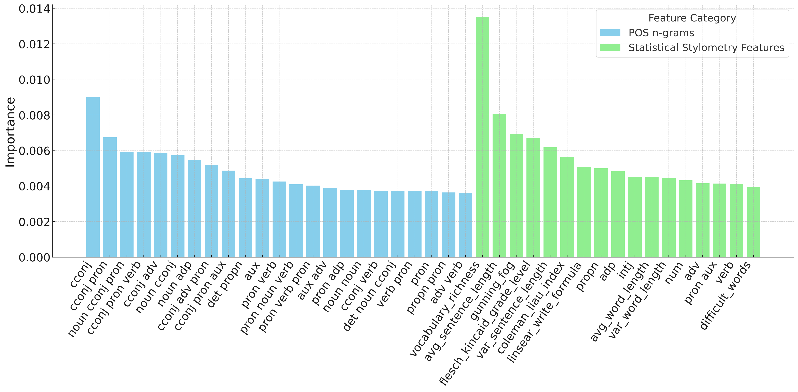

# Safeguarding Speech Content Style: Enhancing Privacy Beyond Speaker Identity

Recent efforts in speech privacy have predominantly focused on anonymizing acoustic speaker attributes, with less emphasis on protecting information conveyed through speech content. Although some research has addressed speech content privacy through content masking and text anonymization by removing personally identifiable information (PII), anonymizing the content style – the "how" of what's said – remains largely unexplored. This paper addresses the challenge of safeguarding information revealed through speech style, not just speaker identity. Inspired by authorship obfuscation techniques, we anonymize the stylistic characteristics of spoken language, crucial in healthcare settings where speech analysis can reveal personal details. Our method paraphrases content style while preserving the original content. Using natural language processing, we identify and de-identify unique speech patterns of individuals. Results show a significant decline in identification accuracy, from 70\% for the original text to 24\% for the paraphrased text of interview transcripts, indicating a substantial level of authorship obfuscation. We evaluated the utility of the anonymized text with the LIWC tool, focusing on tone and positive and negative emotions.

[**doi**:] (10.21437/SPSC.2024-16)

Key features of this project include:
- **Stylometry-based speech analysis**: Identifying unique stylistic elements in text style patterns (40 most important stylistic features can be seen below ([see Feature Importance](#feature-importance)) and obfuscating them.
- **Content style anonymization**: Paraphrasing text (speech content) to protect identity while preserving the meaning.
- **Application in healthcare**: Particularly useful for anonymizing sensitive conversations in clinical or therapeutic environments.
- **Evaluation**: The anonymized text is evaluated using tools like LIWC, focusing on tone and emotional content to assess the usefulness of the new text.

### Results

#### 1. Author Identification Model Accuracies
 

#### 2. Utility Results - LIWC Analysis

### Feature Importance

#### 1. Feature Importance for Identifying Authors Writing About the Same Topic

#### 2. Feature Importance for Identifying Authors Writing About Different Topics

#### 3. Feature Importance for Identifying Holocaust Interviewees

### Contact Us

For more information about this project, please feel free to reach out:

- Yamini Sinha, Mykola Raivakhovskyi, Martha Schubert, Ingo Siegert  
  **Email**: {yamini.sinha, ingo.siegert}@ovgu.de  
  Mobile Dialog Systems, IIKT, Otto-von-Guericke University, Germany

We welcome any questions or feedback related to the project.

**Cite as**: Sinha, Y., Raivakhovskyi, M., Schubert, M., Siegert, I. (2024) Safeguarding Speech Content Style: Enhancing Privacy Beyond Speaker Identity. Proc. 4th Symposium on Security and Privacy in Speech Communication, 92-101, doi: 10.21437/SPSC.2024-16

@inproceedings{sinha24_spsc,
  title     = {Safeguarding Speech Content Style: Enhancing Privacy Beyond Speaker Identity},
  author    = {Yamini Sinha and Mykola Raivakhovskyi and Martha Schubert and Ingo Siegert},
  year      = {2024},
  booktitle = {4th Symposium on Security and Privacy in Speech Communication},
  pages     = {92--101},
  doi       = {10.21437/SPSC.2024-16},
}
